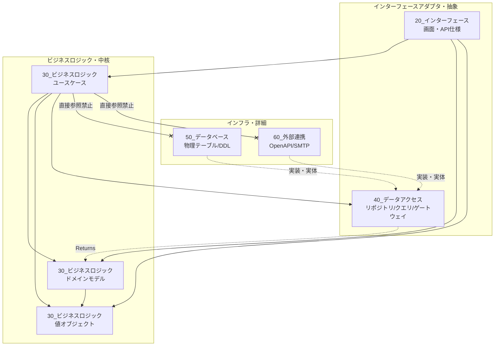

# ディレクトリ構成とアーキテクチャ方針

## 概要

本ドキュメントは、本プロジェクトのリポジトリ構成の意図と、各ディレクトリが担うアーキテクチャ上の役割を定義します。

以下では、ディレクトリ構成の図示、アーキテクチャ概念と依存ルール、具体的な実装ルールを順に説明します。

## 目次

- [1. ディレクトリ構成図](#1-ディレクトリ構成図)
- [2. アーキテクチャ概念と依存ルール](#2-アーキテクチャ概念と依存ルール)
  - [2-1. レイヤー間の依存関係図 (Mermaid)](#2-1-レイヤー間の依存関係図-mermaid)
  - [2.2. 各レイヤーの責務とルール](#22-各レイヤーの責務とルール)
- [3. 具体的な設計・実装ルール](#3-具体的な設計・実装ルール)
  - [3.1. 30番と50/60番の直接参照禁止](#31-30番と5060番の直接参照禁止)
  - [3.2. 依存性の逆転 (Dependency Inversion)](#32-依存性の逆転-dependency-inversion)
  - [3.3. 業務モデルオブジェクトによるコード値の隠蔽（設計書の書き方）](#33-業務モデルオブジェクトによるコード値の隠蔽設計書の書き方)
  - [3.4. 値オブジェクト (Value Object) の活用](#34-値オブジェクト-value-object-の活用)

## 1. ディレクトリ構成図

本プロジェクトはモノリポ構成を採用し、設計情報(docs)と実装コード(apps, libs, infra)を一元管理します。
特に `docs/10_仕様書` 配下は、クリーンアーキテクチャの思想に基づいて階層化されています。
```plain
<root>
├── docs                           # 【ナレッジベース】設計・運用・ルールの正本
│   │
│   ├── 10_仕様書                  # 【WHAT】システムの正解（常に最新化）
│   │   ├── 10_全体方針
│   │   │   ├── システム構成図.md
│   │   │   ├── 機能一覧.md
│   │   │   └── 用語集.md          # 日/英の定義 (UBIQUITOUS LANGUAGE)
│   │   │
│   │   ├── 20_インターフェース     # 【IN / Presentation】
│   │   │   ├── web-api/           # 画面・API仕様
│   │   │   └── batch-app/         # バッチ起動仕様
│   │   │
│   │   ├── 30_ビジネスロジック     # 【PROC / Use Case】
│   │   │   ├── 10_ドメインモデル      # ★重要: 業務データ(Entity)の定義
│   │   │   │   ├── DM01_契約.md    # 「契約」として正しい状態を定義
│   │   │   │   └── DM02_顧客.md
│   │   │   │
│   │   │   ├── 20_値オブジェクト      # ★重要: 再利用可能な型(Value Object)の定義
│   │   │   │   ├── 10_基本型       # 汎用的な型 (Primitives)
│   │   │   │   │   ├── 金額.md
│   │   │   │   │   └── メールアドレス.md
│   │   │   │   ├── 20_識別子       # IDに関する型 (Identifier)
│   │   │   │   │   ├── 契約番号.md
│   │   │   │   │   └── 申込番号.md
│   │   │   │   ├── 30_区分値       # Enum定義
│   │   │   │   │   └── サービス区分.md
│   │   │   │   ├── 40_期間・日時   # 期間・範囲 (Period/Range)
│   │   │   │   │   ├── 有効期間.md
│   │   │   │   │   └── 年度.md
│   │   │   │   └── 50_複合情報     # 複数の属性を持つ型 (Composite)
│   │   │   │       ├── 住所.md
│   │   │   │       └── 氏名.md
│   │   │   │
│   │   │   └── 30_ユースケース        # ★重要: 業務の流れ (機能ID単位)
│   │   │       ├── UC001_契約管理
│   │   │       └── UC999_共通業務
│   │   │
│   │   ├── 40_データアクセス       # 【OUT / Interface Adapter】★重要
│   │   │   │                      # 50, 60を抽象化した「論理的なアクセス仕様」
│   │   │   ├── 10_クエリ              # 参照系 (Read Model) -> 主にDB参照
│   │   │   ├── 20_リポジトリ          # 更新系 (Write Model) -> 50_データベースの抽象化
│   │   │   └── 30_ゲートウェイ        # 外部連携 (External) -> 60_外部連携の抽象化
│   │   │
│   │   ├── 50_データベース         # 【INFRA / Driver】
│   │   │   ├── 10_ddl                # 物理テーブル定義 (SQL正本)
│   │   │   └── 20_マスタデータ        # 初期データ (CSV)
│   │   │
│   │   ├── 60_外部連携             # 【INFRA / Driver】
│   │   │   ├── 10_決済システム     # OpenAPI定義
│   │   │   └── 20_メール配信       # SMTP仕様
│   │   │
│   │   └── 90_共通部品             # 【UTIL】技術的共通機能
│   │
│   ├── 20_ルール方針              # 【HOW】ガイドライン・アーキテクチャ
│   ├── 30_運用保守                # 【RUN】手順書
│   └── 90_プロジェクト計画         # 【PLAN】案件ごとの初期検討ログ
│
├── apps                           # アプリケーションコード (Controller / Main)
├── libs                           # 共通モジュールコード (Service / Repository)
└── infra                          # インフラ定義 (Docker / Tomcat)
```

## 2. アーキテクチャ概念と依存ルール   
本プロジェクトでは、変更に強くテスト容易性を高めるため、クリーンアーキテクチャ（ヘキサゴナルアーキテクチャ） の概念を取り入れています。

### 2-1. レイヤー間の依存関係図 (Mermaid)   
矢印は 「依存の方向（どちらがどちらを知っているか）」 を表します。
依存の矢印は、必ず外側（詳細/インフラ）から内側（抽象/ロジック）へ向かわなければなりません。



### 2.2. 各レイヤーの責務とルール

#### ■ 窓口：20_インターフェース (Presentation / Interface Adapter)

システムの入り口となり、外部との接点となる層です。

役割:

- HTTPリクエストを受け取り、30_ビジネスロジック/ドメインモデルに変換します。

重要な役割:

- 不正な値（マイナスの金額、形式違反のメールアドレスなど）をここで弾き、"正しいドメインモデル"だけを生成してビジネスロジックに渡します。

#### ■ 中核：30_ビジネスロジック (Use Case & Domain Model)

システムの中心です。以下の3つに分離して管理します。

- ドメインモデル (Domain Model / Domain Entity):   

  役割: 業務データの「構造」と「ルール」の定義。識別子（ID）を持ち、ライフサイクルがあるもの。   

  メリット: 生成時にバリデーションを行うため、このオブジェクトが存在する限り「データは正しい」ことが保証されます。

- 値オブジェクト (Value Object):  

  役割: 「契約番号」「金額」「メールアドレス」など、値を表現する小さな型。

  ルール: 不変（Immutable）であり、独自のフォーマットチェックや計算ロジックを持ちます。

  メリット: String や int の代わりにこれを使うことで、取り違えミスを防ぎ、ロジックを分散させません。

- ユースケース (Use Case):

  役割: 業務の「流れ（手続き）」の定義。

  メリット: 入力として「ドメインモデル」を受け取ることで、改めて入力チェックをする必要がなくなり、純粋な業務フローに集中できます。

#### ■ 境界：40_データアクセス (Interface Adapter)

ビジネスロジックが必要とするデータ操作を 「抽象化（Abstraction）」 する層です。
扱う対象によって以下の3つに分類して管理します。

- リポジトリ (Repository):

  役割: 50_データベース の抽象化。

  重要ルール: 戻り値は 50_データベース の物理Entityではなく、30_ビジネスロジック のドメインモデルでなければなりません。 (Reconstitution: 再構成)

- クエリ (Query):

  役割: 50_データベース の抽象化（参照特化）。

  用途: 画面表示用の一覧取得など、パフォーマンスを優先したデータ取得（DTO返却）。

- ゲートウェイ (Gateway):

  役割: 60_外部連携 の抽象化。

  用途: 外部APIの呼び出し、メール送信、ファイル連携など。

#### ■ 詳細：50_データベース / 60_外部連携 (Infrastructure)

システムの最も外側にある、物理的な詳細定義です。

役割:

- 実際にデータを永続化したり、外部と通信したりするための定義（DDL、OpenAPI、SMTP設定）です。

ルール:

- この層の情報（テーブル物理名やAPIのエンドポイント）が、30_ビジネスロジックに漏れ出してはいけません。

## 3. 具体的な設計・実装ルール

### 3.1. 30番と50/60番の直接参照禁止

ビジネスロジックの設計書（および実装コード）において、物理的な定義を直接参照することを禁止します。

* NG (悪い例):

  >「ビジネスロジックにおいて、MD_MOUSHIKOMIテーブル をJOINしてデータを取得し、決済API(POST /v1/pay) をコールする。」

  理由：DBのカラム名変更や、APIのURL変更の影響をロジックが受けてしまうため。

* OK (良い例):

  >「ビジネスロジックにおいて、申込情報リポジトリ(REP01) からデータを取得し、決済ゲートウェイ(GW01) に依頼して決済を実行する。」

  理由：詳細は 40 番台で吸収されるため、ロジックは業務ルールに集中できる。

### 3.2. 依存性の逆転 (Dependency Inversion)

実装（Java）においては、以下の構成になります。

Interface定義: libs/domain-core (30/40相当) に Repository / Gateway Interface を定義する。

実体実装: infra や libs の実装クラスで、DB操作(50)やAPI通信(60)を実装する。

ビジネスロジックは Interface (40) のみに依存 し、実行時にDIコンテナが実体を注入する。

この構成により、DBが存在しない状態での単体テスト（Mock化）や、将来的なDB製品の変更（Oracle→PostgreSQLなど）が容易になります。

### 3.3. 業務モデルオブジェクトによるコード値の隠蔽（設計書の書き方）

「コード値（"1"や"9"）」の意味を解釈するロジックは、30_ビジネスロジック/ドメインモデル に定義します。
40_データアクセス 層のリポジトリは、DBから取得した値をこのドメインモデルに詰め替えて（マッピングして）返却します。

#### 設計ルール:
ドメインモデル設計書: 判定メソッド（例: 基本サービスか？）とその判定条件（コード値）を定義する。

#### リポジトリ設計書:   
DBの値をドメインモデルにどうマッピングするかを定義する。

#### ビジネスロジック(ユースケース)設計書:  
生のコード値（"1"）を使わず、ドメインモデルの 判定メソッド名（論理名） を使用して分岐を書く。

* NG (悪い設計書の書き方):

  ～ ユースケース設計書 ～
  > 分岐: 申込情報のサービス区分が "1" の場合 ...  

  問題点: "1" の意味がユースケースに漏れ出している）

* OK (良い設計書の書き方):

  ～ ドメインモデル設計書の定義 (DM01_契約.md) ～
  > 判定メソッド: isBasicService() (基本サービスか？)   
  > ロジック: サービス区分が "1" の場合に True

  ～ ユースケース設計書の記述 (UC01_契約管理.md) ～
  > 分岐: 申込情報が [基本サービスである] (isBasicService) 場合 ...

### 3.4. 値オブジェクト (Value Object) の活用

「契約番号」や「金額」など、特定のフォーマットやルールを持つ小さなデータは、単なる文字列(String)や数値(int)として扱わず、値オブジェクト として定義します。

* 設計ルール:   
値オブジェクト設計書: 項目定義において、型を「文字列」とするだけでなく、「10桁の英数字」「マイナス不可」といった制約を明記する。

* メリット:   
20_インターフェース 層でオブジェクト生成時にチェックが行われるため、30_ビジネスロジック 層ではデータの正しさを再確認する必要がなくなる（Always-Valid）。